<h1 align="center">CAT-LVDM: Corruption-Aware Training of Latent Video Diffusion Models</h1>

<p align="center">
  <b><a href="https://scholar.google.com/citations?user=YrLydoQAAAAJ&hl=en/">Chika Maduabuchi</a></b>,
  <b><a href="https://hhhhhhao.github.io/">Hao Chen</a></b>,
  <b><a href="https://yujinhanml.github.io/">Yujin Han</a></b>,
  <b><a href="https://jd92.wang/">Jindong Wang</a></b>
</p>

<p align="center">
  <a href="https://catlvdm.github.io/"></a>
  <a href="https://arxiv.org/abs/2405.12345"></a>
  <a href="https://huggingface.co/catlvdm"></a>
  <a href="https://colab.research.google.com/github/catlvdm/demo/blob/main/notebook.ipynb"></a>
</p>

<p align="center">
  <i>This repository contains the code for CAT-LVDM: a corruption-aware training framework for robust latent video diffusion models.</i>
</p>

---

<p align="center">
  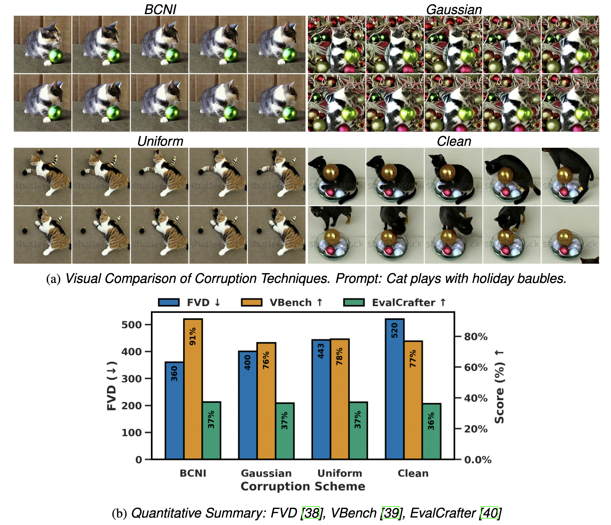
</p>

<p align="center"><b>Figure:</b> <i>(a) Visual comparison of generation quality across corruption schemes</i> (BCNI, Gaussian, Uniform, Clean) for the prompt <b>"Cat plays with holiday baubles."</b> <i>(b) Quantitative summary</i> of performance on FVD (↓), VBench (↑), and EvalCrafter (↑). Our method, <b>BCNI (ours)</b>, outperforms others in both semantic fidelity and motion realism under structured noise.</p>

---

### Robustness under Corruption

<p align="center"><b>Prompt:</b> Rotation, close-up, falling drops of water on ripe cucumbers.</p>

<table align="center">
<tr>
  <td align="center">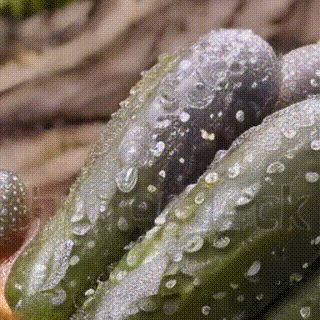<br><b>BCNI (ours)</b></td>
  <td align="center">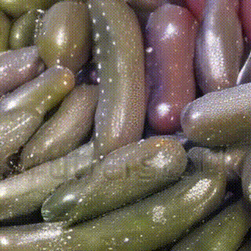<br><b>Gaussian</b></td>
  <td align="center">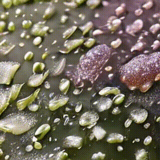<br><b>Uniform</b></td>
  <td align="center">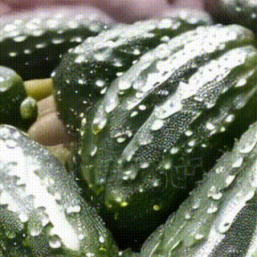<br><b>Clean</b></td>
</tr>
</table>

<p align="center"><b>Prompt:</b> Seascape of coral reef in caribbean sea.</p>

<table align="center">
<tr>
  <td align="center">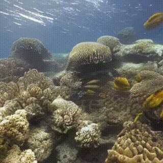<br><b>BCNI (ours)</b></td>
  <td align="center">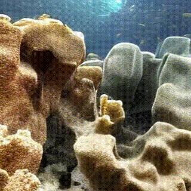<br><b>Gaussian</b></td>
  <td align="center">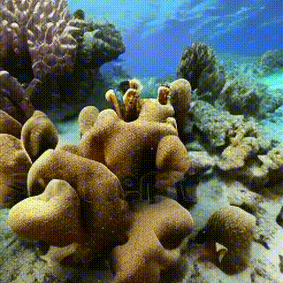<br><b>Uniform</b></td>
  <td align="center">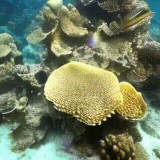<br><b>Clean</b></td>
</tr>
</table>

<p align="center"><b>Prompt:</b> Walking with Dog.</p>

<table align="center">
<tr>
  <td align="center">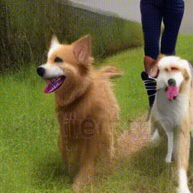<br><b>SACN (ours)</b></td>
  <td align="center">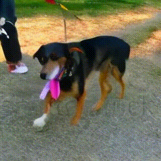<br><b>Gaussian</b></td>
  <td align="center">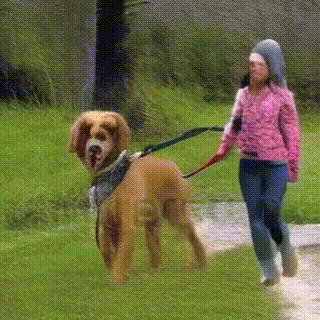<br><b>Uniform</b></td>
  <td align="center">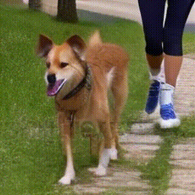<br><b>Clean</b></td>
</tr>
</table>

<p align="center"><b>Prompt:</b> Close up of indian biryani rice slowly cooked and stirred.</p>

<table align="center">
<tr>
  <td align="center">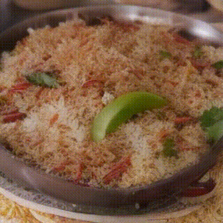<br><b>BCNI (ours)</b></td>
  <td align="center">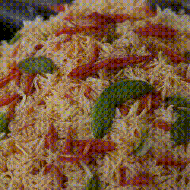<br><b>Gaussian</b></td>
  <td align="center">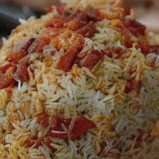<br><b>Uniform</b></td>
  <td align="center">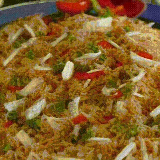<br><b>Clean</b></td>
</tr>
</table>

<p align="center"><b>Prompt:</b> Natural colorful waterfall.</p>

<table align="center">
<tr>
  <td align="center">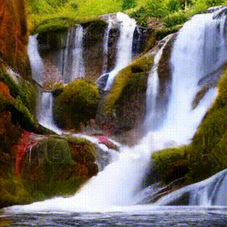<br><b>BCNI (ours)</b></td>
  <td align="center">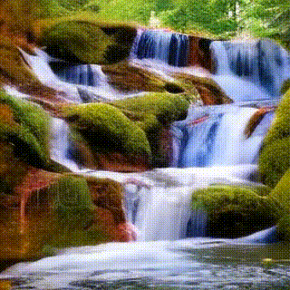<br><b>Gaussian</b></td>
  <td align="center">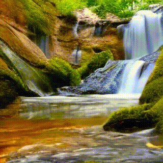<br><b>Uniform</b></td>
  <td align="center">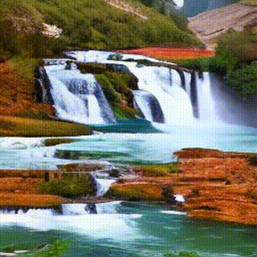<br><b>Clean</b></td>
</tr>
</table>

<p align="center"><b>Prompt:</b> Two business women using a touchpad in the office are busy discussing matters.</p>

<table align="center">
<tr>
  <td align="center"><br><b>BCNI (ours)</b></td>
  <td align="center"><br><b>Gaussian</b></td>
  <td align="center"><br><b>Uniform</b></td>
  <td align="center"><br><b>Clean</b></td>
</tr>
</table>

<p align="center"><b>Prompt:</b> Technician in white coat walking down factory storage, opening laptop and starting work.</p>

<table align="center">
<tr>
  <td align="center">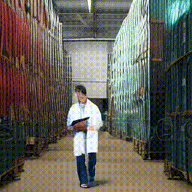<br><b>BCNI (ours)</b></td>
  <td align="center">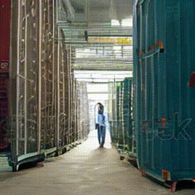<br><b>Gaussian</b></td>
  <td align="center"><br><b>Uniform</b></td>
  <td align="center">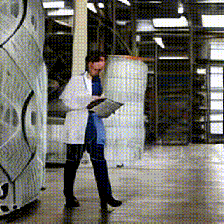<br><b>Clean</b></td>
</tr>
</table>


<!-- GETTING STARTED -->

### 1. Getting Started

This repo implements **CAT-LVDM**, a corruption-aware training framework that improves the robustness of latent video diffusion models via structured noise (BCNI/SACN).

#### Requirements

```
conda create -n catlvdm python=3.8
conda activate catlvdm
pip install -r requirements.txt
```

Ensure compatibility with `torch==2.1.2` compiled with `nvcc 12.1`.


### 2. Inference

To run inference with pre-trained CAT-LVDM checkpoints:

```bash
bash scripts/inference_deepspeed.sh
```

> Output videos are saved in `results/` (default path in config).

Prompts should be formatted as:
```
id,prompt
1,A scientist works in a clean lab.
2,A camel walks across the desert.
```

Configurable options are defined in [`configs/t2v_inference_deepspeed.yaml`](configs/t2v_inference_deepspeed.yaml).


### 3. Training

#### Dataset Setup

This repo supports training on WebVid-2M, MSR-VTT, MSVD, and UCF101.

#### Training Command

```bash
bash scripts/train_deepspeed.sh
```

> To do multi-corruption training on multiple H100 and L40 GPUs. Use the appropriate launch script:
>
> - `bash scripts/multi_train_h100.sh`
> - `bash scripts/multi_train_l40.sh`

Automatically adjusts corruption settings (`BCNI`, `SACN`, etc.) in `configs/t2v_inference_deepspeed.yaml`.

#### TensorBoard

```bash
tensorboard --logdir=tensorboard_log/catlvdm
```

> Logs are saved in `tensorboard_log/catlvdm/`.


<!-- ROADMAP -->
## TODO
- [x] Structured corruption injection
- [x] Full benchmark on 4 datasets
- [ ] Model checkpoints release
- [ ] Model evaluation


<!-- LICENSE -->
## License

Distributed under the MIT License. See [LICENSE.txt](./LICENSE.txt) for more information.


<!-- ACKNOWLEDGMENTS -->
## Acknowledgments

Our implementation is adapted from [DEMO](https://github.com/pr-ryan/DEMO) and [VGen](https://github.com/ali-vilab/VGen). We thank the authors for their open-source contributions.
